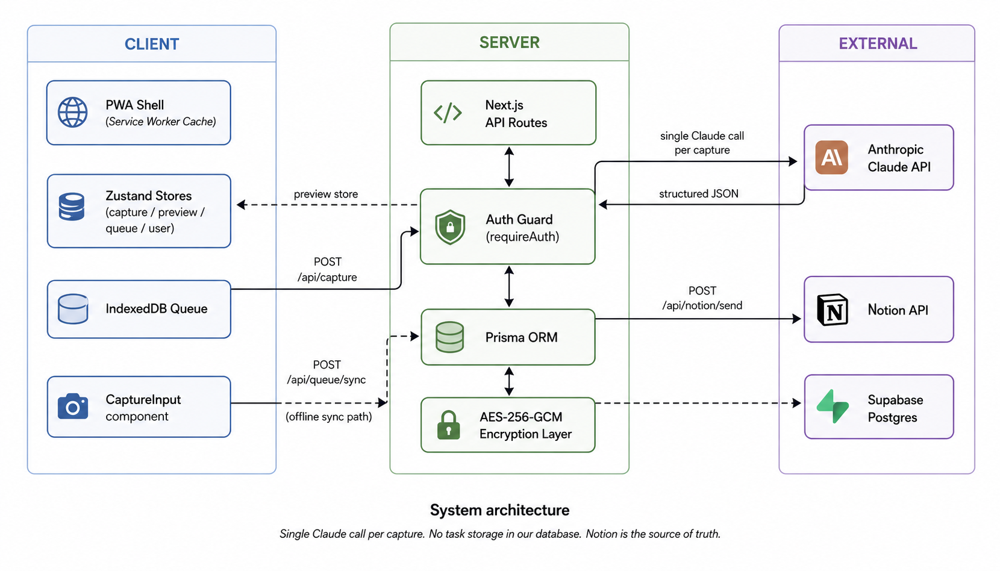
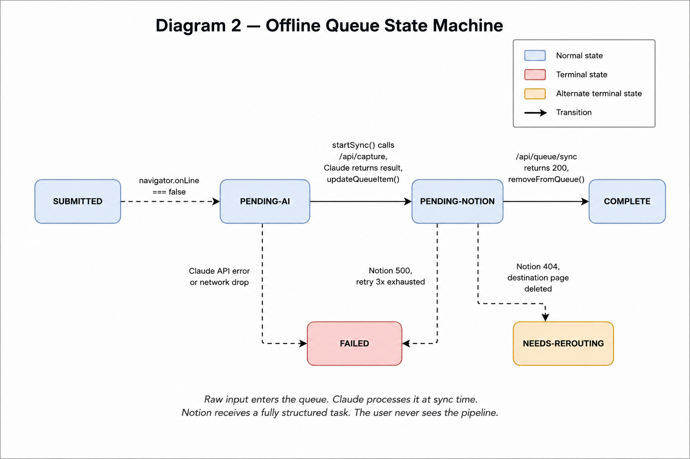
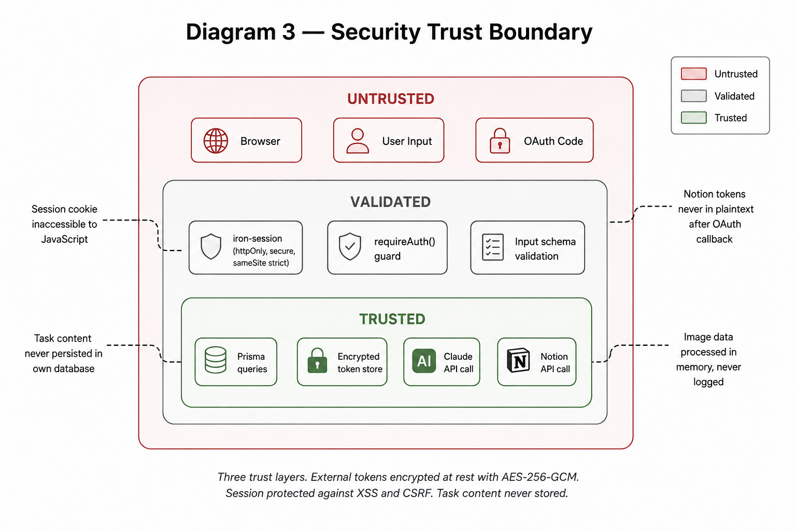

# Nevermist

A PWA that captures thoughts in natural language and lands them in the right Notion page as structured, prioritised, dated tasks — in under 10 seconds, with no navigation decisions.

Built to solve a personal problem: getting a thought into Notion takes 6–7 steps and 90 seconds. By the time you finish, you have either lost the thought or spent more mental energy holding it than it was worth.

**Live at [nevermist.vercel.app](https://nevermist.vercel.app)**

---

<!-- VIDEO DEMO: Replace the block below with your demo video embed or GIF.
     Recommended: a 30–60s screen recording showing text → voice → photo capture.
     For a GIF: 
     For a YouTube embed: [](https://youtube.com/your-link) -->

---

## What it does

You open the app, type anything in natural language, and your thought lands in the correct Notion page as a structured task. The app handles routing, priority, due date, and time extraction automatically.

- **Text** — "call dentist before end of month, important" → P2 task, due Jun 30, routed to Personal
- **Voice** — speak a task, transcription fills the input field
- **Photo** — photograph a handwritten list, each line becomes a separate task
- **URL** — paste a link, title and meta are fetched, saved as a reading item
- **Offline** — captures queue locally when offline, sync when back online
- **Calendar** — tasks with times sync to Google Calendar or Apple Calendar via iCal feed

---

## Architecture



Single LLM call per capture. Task content never stored in own database — Notion is the source of truth.
---

### Offline queue state machine



Raw input enters the queue when offline. The sync engine calls Claude to process it, upgrades the item, then sends to Notion. Sequential, not parallel.

---

## Security



---

## Stack

| Layer | Technology |
|---|---|
| Framework | Next.js 15 App Router, TypeScript |
| Styling | Tailwind CSS v4, Framer Motion |
| State | Zustand |
| Database | Supabase Postgres, Prisma ORM |
| Offline | IndexedDB via idb, Serwist service worker |
| AI | Anthropic Claude API (claude-sonnet-4-6) |
| Auth | Notion OAuth, iron-session |
| Push | web-push, VAPID |
| Deployment | Vercel |

---

## Running locally

**Prerequisites:** Node.js 20+, a Notion integration, a Supabase project, an Anthropic API key.

### 1. Clone and install

```bash
git clone https://github.com/MadhanShankarG/Nevermist.git
cd Nevermist
npm install
```

### 2. Set up environment variables

Copy `.env.example` to `.env.local` and fill in all values:

```bash
cp .env.example .env.local
```

Required variables:

```
# Anthropic
ANTHROPIC_API_KEY=

# Notion OAuth
NOTION_CLIENT_ID=
NOTION_CLIENT_SECRET=
NOTION_REDIRECT_URI=http://localhost:3000/api/auth/callback

# Database
DATABASE_URL=        # Supabase transaction pooler URL (port 6543)
DIRECT_URL=          # Supabase direct connection URL (port 5432)

# Session
SESSION_SECRET=      # 32+ random characters
ENCRYPTION_KEY=      # 32-byte hex string

# Push notifications
VAPID_PUBLIC_KEY=
VAPID_PRIVATE_KEY=
VAPID_SUBJECT=

# Cron
CRON_SECRET=         # Random string to protect cron endpoint

# App
NEXT_PUBLIC_APP_URL=http://localhost:3000

# System prompt
SYSTEM_PROMPT=       # Paste full contents of your system prompt here
```

### 3. Set up Notion OAuth

1. Go to [notion.so/my-integrations](https://notion.so/my-integrations) → New integration
2. Set redirect URI to `http://localhost:3000/api/auth/callback`
3. Copy Client ID and Client Secret to `.env.local`

### 4. Set up database

```bash
npx prisma migrate dev
npx prisma generate
```

### 5. Generate VAPID keys

```bash
npx web-push generate-vapid-keys
```

### 6. Run

```bash
npm run dev
```

Open [http://localhost:3000](http://localhost:3000).

---

## Deploying to Vercel

1. Push to GitHub
2. Import project in Vercel
3. Add all environment variables from `.env.example`
4. Set `NOTION_REDIRECT_URI` to `https://your-domain.vercel.app/api/auth/callback`
5. Update redirect URI in your Notion integration settings
6. Deploy

Vercel cron jobs run daily — push notifications and Supabase keepalive are handled automatically.

---

## Roadmap

- [x] Text, voice, photo, URL capture
- [x] AI routing, priority, due date, time extraction
- [x] Offline queue with sync
- [x] PWA — installable on iOS and Android
- [x] Push notifications
- [x] iCal feed for Google Calendar and Apple Calendar
- [x] Dark and light mode
- [ ] Google Calendar two-way sync — mark done in calendar, marks done in Notion
- [ ] Browser extension — capture from any webpage
- [ ] Smart duplicate detection

---

## License

MIT
